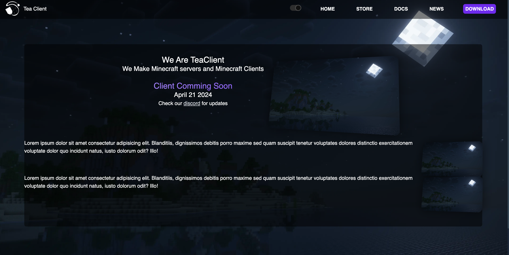

<h3>TeaClient Offical Website</h3>

A website for an Quality of Life

# Features

- News Articles
- Tempaltes with Layouts
- Uses frameworks that you love like Astro & Tailwind.

## Table of Contents

- [Features](#features)
  - [Table of Contents](#table-of-contents)
  - [👀 Want to learn more?](#-want-to-learn-more)
- [Licence](#licence)

## 👀 Want to learn more?

Feel free to check [our wiki](https://teaclient.net/wiki)

# Licence

This Project is licenced under the [Eclipse Public Licence v2.0](https://www.eclipse.org/legal/epl-2.0/)
